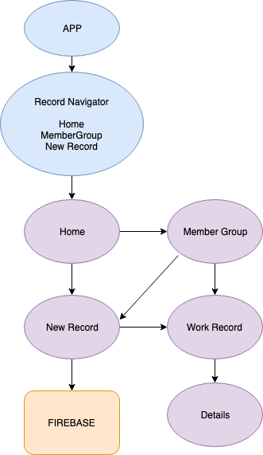

# Trail Stewards

#### iOS or Android Application, 2019_

This application will allow a way for mountain bike advocacy groups across the state of Oregon to accurately track and record volunteer hours and trail-building efforts. It will aggregate this data to be used as a reporting tool for Oregon Mountain Biking Coalition and other state-wide member trail organizations.

#### By _**Christopher Burge**_

### Prerequisites

_Latest version of node.js_
_iPhone or Android device_
_Alternatively you could run on a simulator through Android Studio and XCode_
  _To run iPhone simulator, MacOS required_

### Installing

- Download Expo from the App store or Google Play to your device
  - Alternatively download Android Studio and/or XCode (only available for MacOS)
- Open Terminal
- Type: git clone https://github.com/burgechris/TrailStewards/
- Run: npm install
- Run: expo start
  - Scan the QR code with the Expo app (Android) or the Camera app (iOS)
  - Alternatively: Press a for Android Emulator or i for iOS

## Application Flow and Layout

 

      

## Built With

* [Javascript](https://javascript.info/) - The primary language used
* [Expo](https://expo.io/) - Application Build Service
* [React-Native](https://facebook.github.io/react-native/) - The application library used
* [React-Redux](https://react-redux.js.org/) - State Management
* [React-Native-Navigation](https://reactnavigation.org/) - Screen Navigation
* [Redux-Thunk](https://github.com/reduxjs/redux-thunk) - Middleware for Redux stores
* [Firebase](https://firebase.google.com/) - Used for hosting the application

## Authors

* **Christopher Burge** - [ChrisBurge](https://github.com/burgechris)

## License

*Open-source*

Copyright (c) 2019 **_Christopher Burge_**

## Acknowledgments

* Hat tip to Maximilian Schwarzmüller for countless hours of tutorials on Udemy *

